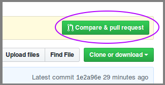

# Guided course

This is a simple crash course in using git to make a contribution. Follow step by step and see your changes online!

## Fork the workshop repo

Go to <https://github.com/taikedz/git-workshop> in a web browser, and click the "Fork" button in the top right:


This wil give you your own version of the repo.

## Clone your repo

Say for example your repository is at `https://github.com/jsmith/git-workshop`

In your command environment, do

```sh
git clone https://github.com/jsmith/git-workshop

cd git-workshop
```

## Run the demo script

There is a runnable script in the repo. Try running it:

```sh
bash demo-script.sh
```

## Branch, and add your name

```sh
# Replace 'jsmith' with your name, no spaces.
git checkout -b add-jsmith
```

Edit the file in `data/participants` in a text editor.

After saving, run the demo script again to see that your name is displayed!

## Stage, commit and push

```sh
git add data/participants
git commit -m "Added (your name) to participants file"
git push --set-upstream origin add-jsmith
```

## Make a pull request

Go to github.com and choose to `Compare & pull request`



Fill in the dialog and submit. Now wait for your PR to be accepted

## Pull in changes from original repo

Update your repo with the original repo

```sh
git pull https://github.com/taikedz/git-workshop master
```

## You're done!

That's it! You successfully made a PR!

[Next >>](06_get_more_help.md)